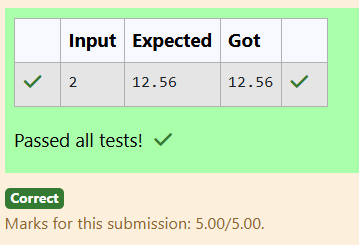

# Ex.No:2(B) METHODS

## QUESTION:
```
Create two methods:

Get the input for radius from the user.

double getArea(double r) → calculate the area and return the area(Don't print anything in this method).

void printArea(double area) → pass the calculated area to this method and print the area of a circle.

```
## AIM:
To develop a Java program that demonstrates the use of **methods** by calculating the **area of a circle**. The program reads the radius from the user, computes the area using a method that returns a value, and prints the result using another method.

## ALGORITHM :
1. Start the program.
2. Import the necessary package `java.util.Scanner` to read input from the user.
3. Create a class named `Main`.
4. Define a method `getArea(double r)` that calculates the area of a circle using the formula `πr²` and returns the computed value.
5. Define another method `printArea(double area)` that receives the calculated area and prints it.
6. In the `main()` method, create a `Scanner` object to read input from the user.
7. Read the radius value from the user.
8. Call the `getArea()` method and store the returned area.
9. Pass the calculated area to the `printArea()` method to display the result.
10. End the program.

## PROGRAM:
 ```
/*
Program to implement a Methods using Java
Developed by: SHYAM S
Register Number: 212223240156
*/

import java.util.Scanner;

public class Main
{
    static double getArea(double r)
    {
        return 3.14*Math.pow(r,2);
    }
    static void printArea(double area)
    {
        System.out.println(area);
    }
    public static void main(String args[])
    {
        Scanner scan=new Scanner(System.in);
        double r=scan.nextDouble();
        double area=getArea(r);
        
        printArea(area);
    }
}
```
## OUTPUT:



## RESULT:
Thus, the Java program to demonstrate the use of **methods for calculating and printing the area of a circle** was successfully implemented and executed.
