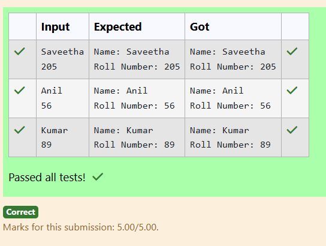

# Ex.No:2(E) ACCESS MODIFIERS

## QUESTION:
```
Create a class Student with variables name, rollNumber. Create a method setDetails(String name, int rollNumber),and display them.
```

## AIM:
To develop a Java program that demonstrates the use of **access modifiers** by creating a `Student` class with private variables `name` and `rollNumber`, setting their values using a public method, and displaying the details.


## ALGORITHM :
1. Start the program.
2. Import the necessary package `java.util.Scanner` to read input from the user.
3. Create a class named `Student`.
4. Declare private instance variables `name` and `rollNumber`.
5. Create a public method `setDetails(String name, int rollNumber)` to assign values to the private variables using the `this` keyword.
6. Create another public method `display()` to print the student details.
7. Create a class `Main` containing the `main()` method.
8. Create a `Scanner` object to read input values from the user.
9. Read the student's name and roll number from the user.
10. Create an object of the `Student` class.
11. Call the `setDetails()` method to assign the input values.
12. Call the `display()` method to print the student details.
13. Stop the program.
## PROGRAM:
 ```
/*
Program to implement a Access Modifiers using Java
Developed by: SHYAM S
Register Number: 212223240156
*/

import java.util.Scanner;

class Student {
    private String name;
    private int rollNumber;

    public void setDetails(String name, int rollNumber) {
        this.name = name;
        this.rollNumber = rollNumber;
    }

    public void display() {
        System.out.println("Name: " + name);
        System.out.println("Roll Number: " + rollNumber);
    }
}

public class Main {
    public static void main(String[] args) {
        Scanner scan = new Scanner(System.in);

        String name = scan.nextLine();
        int rollNumber = scan.nextInt();

        Student s = new Student();
        s.setDetails(name, rollNumber);
        s.display();
    }
}

```
## OUTPUT:



## RESULT:
Thus, the Java program to demonstrate the use of **access modifiers with private variables and public methods in a Student class** was successfully implemented and executed.
