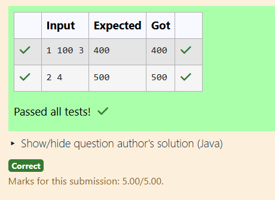

# Ex.No:3(C) ABSTRACTION

## QUESTION:
```
Description:
Create abstract class GameScore with method finalScore().
Subclasses:

ArcadeGame: score = baseScore + (level × 100)

PuzzleGame: score = (attempts ≤ 3) ? 1000 - (attempts × 100) : 500

Input Format:

First line: 1 or 2
Second line: base, level (or attempts)

Output Format:

Final score (int)
```

## AIM:
To develop a Java program that demonstrates **abstraction** by creating an abstract class `GameScore` with an abstract method `finalScore()`, and implementing it in derived classes `ArcadeGame` and `PuzzleGame` to calculate the final game score based on different rules.

## ALGORITHM :
1. Start the program.
2. Import the necessary package `java.util.Scanner` to read input from the user.
3. Create an abstract class named `GameScore`.
4. Declare an abstract method `finalScore()` inside the `GameScore` class.
5. Create a class `ArcadeGame` that extends the `GameScore` class.
6. Declare variables `baseScore` and `level`.
7. Create a constructor to initialize `baseScore` and `level`.
8. Override the `finalScore()` method to calculate the score using the formula  
   `baseScore + (level × 100)`.
9. Create another class `PuzzleGame` that extends the `GameScore` class.
10. Declare a variable `attempts`.
11. Create a constructor to initialize `attempts`.
12. Override the `finalScore()` method to calculate the score using the condition:  
    - If attempts ≤ 3 → `1000 − (attempts × 100)`  
    - Otherwise → `500`.
13. Create the `Main` class containing the `main()` method.
14. Use a `Scanner` object to read the game type from the user.
15. If the type is `1`, read `baseScore` and `level` and create an `ArcadeGame` object.
16. Otherwise, read `attempts` and create a `PuzzleGame` object.
17. Call the `finalScore()` method using the base class reference.
18. Display the final score.
19. Stop the program.

## PROGRAM:
 ```
/*
Program to implement a Abstraction using Java
Developed by: SHYAM S
Register Number: 212223240156
*/

import java.util.*;

abstract class GameScore
{
    abstract int finalScore();
}

class ArcadeGame extends GameScore
{
    int baseScore, level;
    ArcadeGame(int baseScore, int level)
    {
        this.baseScore=baseScore;
        this.level=level;
    }
    int finalScore()
    {
        return baseScore + (level * 100);
    }
}

class PuzzleGame extends GameScore
{
    int attempts;
    PuzzleGame(int attempts)
    {
        this.attempts=attempts;
    }
    int finalScore()
    {
        return (attempts <= 3) ? 1000-(attempts*100) : 500;
    }
}

public class Main
{
    public static void main(String args[])
    {
        Scanner scan = new Scanner(System.in);
        int type=scan.nextInt();
        
        GameScore GS;
        if(type==1)
        {
            int baseScore=scan.nextInt();
            int level=scan.nextInt();
            GS=new ArcadeGame(baseScore, level);
        }
        else
        {
            int attempts=scan.nextInt();
            GS=new PuzzleGame(attempts);
        }
        System.out.println(GS.finalScore());
    }
}
```

## OUTPUT:



## RESULT:
Thus, the Java program demonstrating **abstraction using an abstract class GameScore with subclasses ArcadeGame and PuzzleGame to calculate the final score** was successfully implemented and executed.
