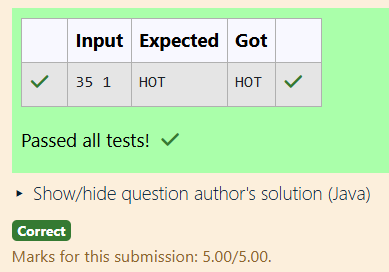

# Ex.No:3(D)    INTERFACE 

## QUESTION:
```
You are programming bots that analyze weather data. Each bot must implement a common interface and give a prediction.


 Bot Types:

SunBot: Predicts "HOT" if temperature > 30, else "MODERATE".

RainBot: Predicts "COLD" if temperature < 20, else "WARM".

Input:

temperature
botType (1 for SunBot, 2 for RainBot)Output:
Prediction as a string.
```

## AIM:
To develop a Java program that demonstrates the use of an **interface** by creating a common interface `WeatherBot` and implementing it in different classes (`SunBot` and `RainBot`) to predict weather conditions based on temperature.

## ALGORITHM :
1. Start the program.
2. Import the necessary package `java.util.Scanner` to read input from the user.
3. Create an interface named `WeatherBot`.
4. Declare an abstract method `predict(int temperature)` inside the interface.
5. Create a class `SunBot` that implements the `WeatherBot` interface.
6. Implement the `predict()` method to return **"HOT"** if the temperature is greater than 30, otherwise return **"MODERATE"**.
7. Create another class `RainBot` that implements the `WeatherBot` interface.
8. Implement the `predict()` method to return **"COLD"** if the temperature is less than 20, otherwise return **"WARM"**.
9. Create a class `Main` containing the `main()` method.
10. Create a `Scanner` object to read input values from the user.
11. Read the temperature and bot type from the user.
12. If the bot type is `1`, create an object of `SunBot`.
13. Otherwise, create an object of `RainBot`.
14. Call the `predict()` method using the interface reference.
15. Display the predicted weather condition.
16. Stop the program.

## PROGRAM:
 ```
/*
Program to implement a Interface using Java
Developed by: SHYAM S
Register Number: 212223240156
*/

import java.util.*;

interface WeatherBot {
    String predict(int temperature);
}

class SunBot implements WeatherBot {
    public String predict(int temperature) {
        if (temperature > 30)
            return "HOT";
        else
            return "MODERATE";
    }
}

class RainBot implements WeatherBot {
    public String predict(int temperature) {
        if (temperature < 20)
            return "COLD";
        else
            return "WARM";
    }
}

public class Main {
    public static void main(String[] args) {
        Scanner sc = new Scanner(System.in);

        int temperature = sc.nextInt();
        int botType = sc.nextInt();

        WeatherBot bot;

        if (botType == 1) {
            bot = new SunBot();
        } else {
            bot = new RainBot();
        }

        System.out.println(bot.predict(temperature));
    }
}
```

## OUTPUT:



## RESULT:
Thus, the Java program demonstrating the use of an **interface (WeatherBot) with implementing classes SunBot and RainBot to predict weather conditions based on temperature** was successfully implemented and executed.
