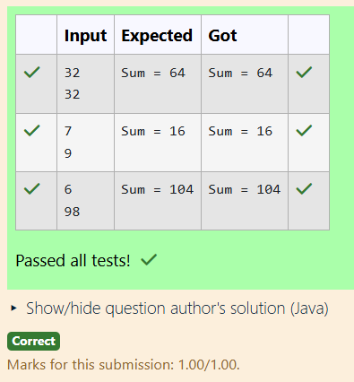

# Ex.No:3(F) WRAPPER CLASS

## QUESTION:
```
Write a Java program to convert a string to an integer using a wrapper class and perform addition.
```
## AIM:
To develop a Java program that demonstrates the use of a **wrapper class** by converting string values into integers using the `Integer` class and performing an addition operation.

## ALGORITHM :
1. Start the program.
2. Import the necessary package `java.util.Scanner` to read input from the user.
3. Create a class named `Main`.
4. Inside the `main()` method, create a `Scanner` object.
5. Read two string values from the user.
6. Use the wrapper class method `Integer.parseInt()` to convert the string values into integers.
7. Store the converted integer values in variables.
8. Perform addition of the two integer values.
9. Display the result of the addition.
10. Stop the program.

## PROGRAM:
 ```
/*
Program to implement a Wrapper Class using Java
Developed by: SHYAM S
Register Number: 212223240156
*/

import java.util.Scanner;

public class Main
{
    public static void main(String args[])
    {
        Scanner scan = new Scanner(System.in);
        String s1=scan.nextLine();
        String s2=scan.nextLine();
        
        int num1=Integer.parseInt(s1);
        int num2=Integer.parseInt(s2);
        int sum=num1+num2;
        
        System.out.println("Sum = "+sum);
    }
}
```
## OUTPUT:



## RESULT:
Thus, the Java program demonstrating the use of a **wrapper class to convert strings to integers and perform addition** was successfully implemented and executed.
